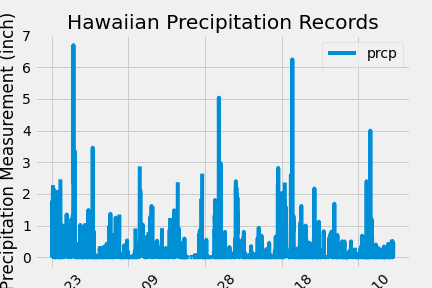
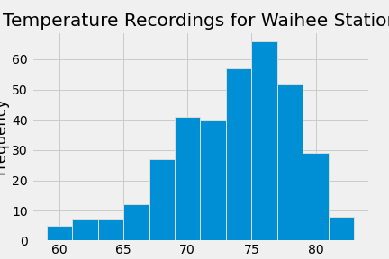
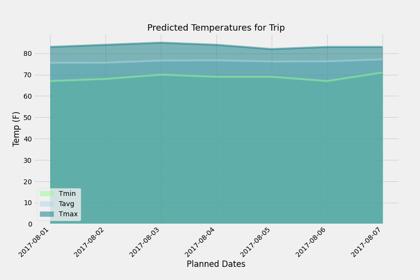

###Hawaiian Climate Analysis

The Hawaiian Climate Analysis project analyzed data from multiple weather stations across the Hawaiian Islands.  

The objective was to identify trends is temperature and precipitation to assist individuals when making travel plans.  

Multi-year weather station observations were retrieved using SQLAlchemy ORM queries.  

The data was then explored using a combination of Pandas and Matplotlib.  

Additionally, a Flask API was designed to retrieve the outcome of the initial analysis performed.   

### Precipitation Analysis
I conducted the precipitation analysis by finding the most recent date in the data set then used this to retrieve an annualized sample from the preceding 12 months. 

Statistical analysis was performed on this 12 month data set, and the data was then plotted. 

### Station Analysis
The next set of queries identified the total number or reporting stations in the data set then isolated the most actively reporting station (i.e. the station with the greatest number of observations).  

From this station, the highest, lowest, and average temperatures were calculated using the `func.min`, `func.max`, `func.avg`, functions across the entirety of the observable data. 

Next, I designed a query to retrieve the last 12 months of temperature observation data from the most actively reporting station.  

I then constructed queries to plot this information using a histogram format.  

Once this initial analysis was completed, I designed a Flask API based on the previously designed queries.  

The Flask_Climate_App returned a list of minimum temperature, the average temperature, and the max temperatures for a date or date range in a JSON format. 

###Temperate Climate Analysis
The next set of temperature queries was designed to identify if there is a meaningful difference in island temperature for June and December as Hawaii is reputed to have year-round temperate weather.  

To perform this analysis Pandas was leveraged to convert strings to datetime.  

I then constructed two data frames which filtered all observable data to two sample months June and December.   

The average temperature was then identified, and a t-test performed to reflect if there is a statistically significant difference in the means. 

### Travel Period Analysis
The final analysis performed was to transform the overall climate analysis into a set of queries that could be leveraged for trip planning.  

I created queries that leveraged the dates of August first to August seventh to understand the historical data for that time period. 

The minimum, average, and maximum temperatures were then plotted for this timeframe.  

Similar queries were then constructed to calculate the normal rainfall over that date range.  

###Contact
Lauren Parrish
ljeanparrish@gmail.com
